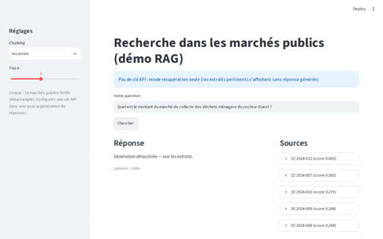

# decp-contracts-rag

RAG over French public procurement contracts, with an eval harness that tells you whether it's any good.



## Why this exists

Every RAG demo answers questions. Almost none of them can tell you if they retrieved the right documents, whether the answer is actually faithful to the sources, or what each query costs. I built the eval harness first and the demo second, because that's the order the job really requires.

The corpus is French public contracts (*marchés publics*, DECP data) — a domain I already explored in my [procurement risk detection project](https://github.com/Abdoutzo/DETECTION-DE-RISQUES-DANS-LES-MARCHES-PUBLICS-DECP-PAR-ANALYSE-DE-GRAPHES). Questions like "which contracts went to company X?" are exactly the kind where a wrong answer costs real money, so citations aren't optional here.

## What it does

- Ingests contract records and chunks them with three strategies: fixed-size, recursive (sentence-aware), and semantic (embedding breakpoints)
- Retrieves with multilingual embeddings + FAISS, answers with numbered citations via Mistral or OpenAI
- Says "I don't know" when the documents don't contain the answer — and that's tested, not just prompted
- The eval suite compares strategies on recall@5, MRR, faithfulness, latency, and cost per query

## Results

Sample corpus: 14 contracts, 20 grounded questions (factual, multi-doc, aggregation, one unanswerable).

| strategy  | chunks | recall@5 | MRR   | latency p50 |
|-----------|--------|----------|-------|-------------|
| fixed     | 26     | 0.821    | 0.651 | 0.22s       |
| recursive | 14     | 0.771    | 0.572 | 0.18s       |
| semantic  | 23     | 0.842    | 0.653 | 0.18s       |

*Run `python evals/run_eval.py` to reproduce. Retrieval metrics are deterministic — no LLM needed.*

Takeaway: the honest result is that on short structured records, the gaps are small and naive fixed windows are surprisingly competitive. Recursive underperforms here because each document fits in a single chunk, which dilutes the embedding. Semantic wins marginally but costs an extra embedding pass at index time. The point isn't that one strategy dominates — it's that I can show you the numbers instead of asserting a best practice.

## Architecture

```text
corpus (DECP / sample)
   │  src/ingest.py — chunk_fixed / chunk_recursive / chunk_semantic
   ▼
chunks → embeddings (multilingual MPNet) → FAISS IndexFlatIP
   │
   ▼  src/answer.py
retrieve top-k → prompt with numbered sources → LLM → cited answer + latency + cost
   │
   ▼  evals/run_eval.py
20 grounded questions → recall / MRR / faithfulness / latency / cost → evals/report.md
```

## Quickstart

See [QUICKSTART.md](QUICKSTART.md). The short version:

```bash
pip install -r requirements.txt
python evals/run_eval.py      # retrieval evals, no API key needed
streamlit run app.py          # demo UI
```

Add a `MISTRAL_API_KEY` or `OPENAI_API_KEY` to `.env` and re-run with
`--with-answers` for faithfulness scoring and cost estimates.

## Repo map

```text
src/ingest.py      document loading + the three chunking strategies
src/embeddings.py  sentence-transformers wrapper (L2-normalized)
src/store.py       FAISS vector store
src/answer.py      retrieval + cited answer generation + cost tracking
src/metrics.py     recall@k, MRR, heuristic faithfulness
scripts/build_index.py   CLI to build a persistent index
evals/run_eval.py        the harness; writes evals/report.md
evals/questions.jsonl    20 questions grounded in the sample corpus
data/sample/             14 synthetic French contracts (reproducible evals)
data/README.md           how to plug in the real DECP open data
app.py                   Streamlit demo (Render-ready)
.github/workflows/eval.yml   CI: unit tests + retrieval evals on every push
```

## Limitations (honest ones)

- The sample corpus is synthetic. Real DECP data is messier — that's documented in `data/README.md`, not solved here.
- Faithfulness is a token-overlap heuristic. It catches blatant hallucinations; it won't catch subtle misreadings. An LLM judge would be the next step.
- `IndexFlatIP` is exact search and won't scale to the full DECP dump. Switch to IVF when you do.
- Prompts are French-first. The pipeline is language-agnostic, the eval questions aren't.

## Roadmap

- Hybrid retrieval (BM25 + dense) with a cross-encoder reranker
- LLM-judge faithfulness behind the same function signature
- Real DECP loader + IVF index for the full dataset
- Query rewriting for the multi-hop questions

## License

MIT
